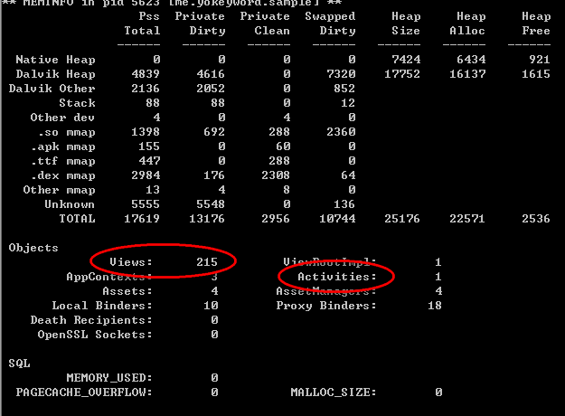
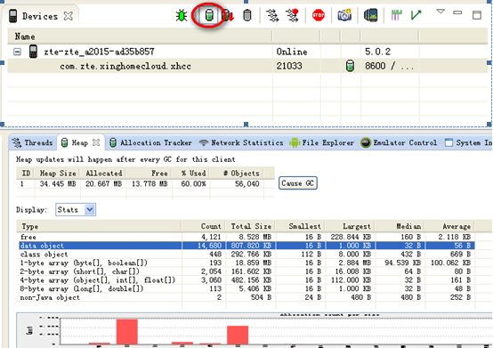
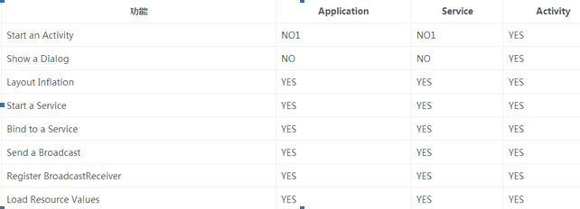

# **内存泄露和内存优化**
　　对于Android来说，每一个APP的内存是有限的。你过你的内存出现问题：泄露，长期占用过高，就会导致app易于被杀掉。频繁的gc导致app卡顿等现象。

## **内存泄露**

### **常见情况**
* **Activity的Context的使用**  
 	* 界面的Context静态化  
	* 单例式将界面的Context作为初始化入参数，并且在单例模式保存
	* 特殊的，在Android 6.0中，不能使用Activity的Context通过接口getSystemService()来获取各种Manager，如下所示： 
 
	```  
	AActivityManager activityManager =(ActivityManager)MainActivity.this.getSystemService(Context.ACTIVITY_SERVICE);  
	```  
如上所示，在Android 6.0 中就会造成内存泄露


* **非静态内部类持有外部类的引用**  

　　在Java中，非静态内部类（包括匿名内部类）都会持有外部类（一般是指Activity）的引用，当两者的生命周期出现不一致的时候，很容易导致内存泄露。	
　
　　如下所示，非常常见的几种情况:   
**Hanlder**   

```
private Handler mHandler = new Handler() {
 @Override    
 public void handleMessage(Message msg)      
 {   
　　super.handleMessage(msg);  
 }  
}; 
```  
　　这里的Handler会引用Activity的引用，当handler调用postDelay的时候，若Activity已经finish掉了，因为这个 handler 会在一段时间内继续被 main Looper 持有，导致引用仍然存在，在这段时间内，如果内存吃紧至超出，是很危险的。  

**Thread**   

```
public class ThreadActivity extends Activity {  
    public void onCreate(Bundle savedInstanceState) {  
        super.onCreate(savedInstanceState);  
        setContentView(R.layout.activity_main);  
        new MyThread().start();  
    }  
  
    private class MyThread extends Thread {  
        @Override  
        public void run() {  
            super.run();  
            dosomthing();  
        }  
    }  
    private void dosomthing(){  
      
    }  
}  
```
　　假设MyThread的run函数是一个很费时的操作，当我们开启该线程后，将设备的横屏变为了竖屏，一般情况下当屏幕转换时会重新创建Activity，按照我们的想法，老的Activity应该会被销毁才对，然而事实上并非如此。由于我们的线程是Activity的内部类，所以MyThread中保存了Activity的一个引用，当MyThread的run函数没有结束时，MyThread是不会被销毁的，因此它所引用的老的Activity也不会被销毁，因此就出现了内存泄露的问题。  

**Runnable**   

```
  public class MainActivity extends Activity {
    ...
    Runnable ref1 = new MyRunable();
    Runnable ref2 = new Runnable() {
        @Override
        public void run() {

        }
    };
       ...
    }
```

　　ref1和ref2的区别是，ref2使用了**匿名内部类**，也就是说当前的Activity会被ref2所应用，如果将这个引用传入到了一个异步线程，该线程的生命周期与Activity的生命周期不一致的时候，就会导致内存泄露。

* **Static变量造成内存泄露**    

	* 界面类的静态化
	* 界面中View的静态化
	* 非静态内部类的静态化  
具体的 如下所示：  

```
public class MainActivity extends AppCompatActivity {  

    private static Drawable sDrawable;

    @Override protected void onCreate(Bundle savedInstanceState) {
        super.onCreate(savedInstanceState);
        TextView lableView = new TextView(this);
	if(sDrawable == null) {
		sDrawable = getDrawable(R.drawable.icon);		
	}
	labelView.setBackgroundDrawable(sDrawable);
        setContentView(lableView);
    }
}  
```

　　View的setBackgroundDrawable()的源码如下所示：  

```
public void setBackgroundDrawable(Drawable background) {
        ...

        if (background != null) {
            ...

            background.setCallback(this);
            ...
        } else {
            ...
        }

        ...
}
```
　　其中有一个background.setCallback(this);，所以这就导致这个静态变量指向的对象又持有了TextView这个对象的引用，TextView持有的确实整个Activity的引用。这样就导致了内存泄露。

　　我们再来看一个例子： 

```
public class MainActivity extends AppCompatActivity {
    private static InnerClass sInnerClass;

    @Override protected void onCreate(Bundle savedInstanceState) {
        super.onCreate(savedInstanceState);
        setContentView(R.layout.activity_leak);
        sHello = new Hello();
    }
    public class InnerClass {}
}  
```
　　静态的非静态内部类对象sInnerClass持有了外部Acitivity的引用，当屏幕发生变化时，不会被释放。

* **资源没有关闭**  

	* Cursor游标没有关闭
	* InputStream、OutputStream等没有关闭
	* 注册的广播等没有unRegister
	* 一些CallBack的Listener没有被清除

* **View添加到没有删除机制的容器中**
  

* **过期引用**   

　　当一个数组扩容后又被缩减，比如size从0->200->100(一个栈先增长，后收缩)，那么元素的index>=100的那些元素（被Pop掉的）都算是过期的元素，那些引用就是过期的引用（永远不会再被接触的应用）-来自Effective Java  

```
public Object pop(){
  	  if(size==0) throw new EmptyStackException();
  	  Object result = elements[--size];
   	 elements[size] = null; //消除过期引用
   	 return result;
}

```
　　由于过期引用的存在，GC并不会去回收他们，我们需要手动的释放他们。


### **内存溢出和内存的查看方法**

 * **使用第三方开源库**  

[LeakCanary](https://github.com/square/leakcanary)  
在这里就不做具体的介绍了。网上的使用demo:   
[leakCanary Demo](https://github.com/liaohuqiu/leakcanary-demo)  

* **adb shell命令**  

　　通过以下命令可以查看你APP的内存使用情况已经Activity和View等的个数情况，具体的  

```
adb shell dumpsys meminfo packagename
```
　　其中，packagename就是你程序的报名，具体的示例，如下图所示:  
     

　　如上图所示：  
　　上面部分显示的是你的app所占用的内存总数（主要是看TOTAL，内存所实际占用的值）   
　　下面的部分可以看到你的一些对象的个数：如Views、Activities等。
当你进入一个acitivity的时候，activity的个数会增加，退出后会减少，如果只增加、不减少，就说明出现了内存泄露的问题。  


* **DDMS**  

　　DDMS是Android开发环境中的Dalvik虚拟机（andoid4.4之前，4.4及其之后引入了ART虚拟机）调试监控服务。  

　　1. update heap  

  

　　对一个activity进入退出反复多次看data object是否稳定在一个范围  
　　2. MAT(Memory Analyzer Tool) 

   

　　dump hprof file : 点击后等待一会，会生成一个hprof文件。插件版本的MAT可以直接打开该文件，否则需要进行一步转换操作。 提供了这个工具 hprof-conv (位于 sdk/tools下), 转换命令如下所示:  

```
./hprof-conv xxx-a.hprof xxx-b.hprof 
```


## **内存优化建议**  

* **了解你机器的内存情况**  

　　通过以下代码可以查看**每个进程可用的最大内存**，即heapgrowthlimit值  

```
ActivityManager actManager = getApplicationContext.getSystemService(Context.ACTIVITY_SERVICE);s int memClass = actManager.getMemeoryClass(); //以M为单位
```

　　通过以下代码可以获取  **应用程序的最大可用内存**  

```
long maxMemory = Runtime.getRuntime().maxMemeory(); //以字节为单位
```

**两者的区别：**    
　　单位不一致  前者以M为单位，后者以字节为单位。  
　　具体的以lenovo的一款手机（S850T， Android版本为4.4.2）为例： 经过测试两者得到的值一致均是128M。

**使用场景**  
　　当你进行图片加载的时候，都会使用到LRUCache，初始化的时候设置缓存的大小。一般来说都设置为当前最大内存的1/8,如果你就是一个图片应用你直接1/4也可以。 

```
long cacheSize = Runtime.getRuntime().maxMemeory();
mLruCache = new LruCache<String, Bitmap>(cacheSize)
        {
            @Override
            protected int sizeOf(String key, Bitmap value)
            {
                return value.getRowBytes() * value.getHeight();
            };
        };
```

* **当界面不可见、内存紧张的时候释放内存**    

android4.0(包含4.0)之后引入了onTrimMemory（int level）(4.0之前为onLowMemory) ，系统会根据不同的内存状态来毁掉，参数 level 代表了你app的不同状态，Application、Activity、Fragment、Service、ContentProvider均可以响应。具体如下：    

**TRIM_MEMORY_UI_HIDDEN**： 应用程序被隐藏了，如按了Home或者Back导致UI不可见，这个时候，我们应该释放一些内存。  

*以下三个是我们的应用程序真正运行时的回调：*  
**TRIM_MEMORY_RUNNING_MODERATE**： 程序正常运行，并不会被杀掉，但是手机的内存有点低了，系统可能开始根据LRU规则来杀死进程了。  
**TRIM_MEMORY_RUNNING_LOW**: 程序正常运行，并不会被杀掉，但是手机内存非常的低了，应该释放一些资源了，否则影响性能。  
**TRIM_MEMORY_RUNNING_CRITICAL**:  程序正在运行，但是系统已经根据LRU杀死了大部分缓存的进程了，此时我们需要释放内存，否则系统可能会干掉你。    

*以下三个是当应用程序是缓存时候的回调：*  
**TRIM_MEMORY_BACKGROUND**： 内存不足，并且该进程是后台进程。   
**TRIM_MEMORY_MODERATE**： 内存不足，并且该进程在后台进程列表的中部。  
**TRIM_MEMORY_COMPLETE**:内存不足，并且该进程在后台进程列表的最后一个，马上就要被清理了，这个时候应该把一切尽可能释放的都释放掉。  


通常在我们开始进行架构设计的时候，就要考虑到哪些东西是要常驻的，哪些东西是缓存后要被清理， 一般情况下，以下资源都要被清理：  
**缓存**：包括文件缓存、图片的缓存、比如第三方图片缓存库。  
**一些动态生成的View**： 比如一般应用的图片轮播View，在你的应用隐藏后，根本不需要轮播。    

**案例分析：**      
1. LRUCache缓存的清理方式：trimToSize()接口可以重新设置缓存的大小。evictAll()接口可以清楚所有的LRUCache缓存内容。  
2. 暴力清理界面中的View  

* **图片资源的压缩**  
		1. res中资源到压缩: 使用有损压缩工具，比如：[tinyPng](https://tinypng.com/)，压缩后的图片肉眼根本看不出来，压缩率可以达到50%以上
		2. BitmapFactory的压缩    


* **使用Android优化过的类和集合**   
	1. SparseArrry<T>来替代HashMap<int, T> 
	2. LongSparseArray<T>， key为long，替代HashMap<long, T>
	3. SimpleArrayMap<K, T>和ArrayMap<K,T>替代HashMap<K, T>, ArrayMap是通过时间来换取效率，在数千之内建议使用ArrayMap


* **避免创建不必要的对象**   

在短时间内创建了大量的对象，然后有释放，这样就引起了**内存抖动**。频繁的引起GC操作，会导致内存的卡顿。  
	1. 字符串的拼接：StringBuffer(非线程安全)和StringBuilder(线程安全)的使用  
	2. 自定义View中不要在onDraw中定义画笔等对象  
	3. 在循环函数内避免创建重复的对象，将多个函数都经常用到的不可变对象拿出来统一进行初始化，在一开始写的时候就要特别的注意，否则后边修改起来很是麻烦（主要是再找到他很麻烦）   
	4. 在循环的内部不要使用try catch操作，将其拿到外面来。  
	5. 不要在循环中进行文件的操作：比如判断文件是否存在，这相对是一个很耗时的操作

**案例说明**  
　　SimpleDateFromat是用来时间转换的，一般的，开发者都会定义个专门用于时间转化的static的函数：  

```
public static String paserTimeToYM(long time)
    {
        SimpleDateFormat format = new SimpleDateFormat("yyyy年MM月dd日", Locale.getDefault());
        return format.format(new Date(time));
    } 
```
　　假如你在for循环中调用此函数。就不停的重复创建SimpleDateFromat对象。你应该将对象创建拿出来，放在类中，或者是重新定义一个时间转换函数，入惨为已经创建好的SimpleDateFormat对象。  
　　还需要注意的是：假如你的循环量很大，不建议在for循环中进行时间转换，而是在你用到的时候才进行转换，比如显示出来。 


* **不要扩大变量的作用域**    

```
classs A
{
	private B mB;
	public A(B b) {
		this.mB = b;
		//就在构造函数中进行了对mB进行了一些操作
	}
	//后续再也没有用到过mB
}

class B
{
	public B() {
	}
	public static void main(String[] args)
	{
	}
}
```
　　如上所示的简单代码：类A的构造函数中，传入了类B的对象，并且类A中定义了成员变量mB，但是mB就在构造函数中用了一下，后续再也没有用，在类A中mB的生命周期和A一致。本来mB的作用域就在构造函数，结果扩大为整个类。  


* **不要让生命周期比Activity长的对象持有Activity的引用**   

　　这样的错误很多，比如：将Activity的Context传给单例模式，毫不知情的将Activity的Context传给非静态内部类或者是匿名内部类。

* **尽量的使用Application的Context**  

　　Application的生命周期是整个app，他会一直在。  
　　1. 在界面类中直接使用getApplicationContext。  
　　2. 在其他地方使用MyApplication(extends Application)的getInstance操作。如下所示：

```
public class MyApplication extends Application
{
    private static Context sContext;
 
    @Override
    public void onCreate()
    {
        Log.d(tag, "onCreate");
        sContext = this;
    }

    public static Context getAppContext()
    {
        return sContext;
    }
}
```
总之一句话：能使用Application的Context，就不要使用Activity的。关于Android不同组件的Context能做到的事情如下图所示：
  
   

其中：NO1表示Application和Service可以启动一个Activity，不过需要创建一个新的task任务队列。而对于Dialog而言，只有在Activity中才能创建。

* **移除回调**  
		1. handler的removeCallbacksAndMessages(null) 
		2. setXXXCallback(null)、 setXXXListener(null)，需要注意的是，要进行callback调用的地方就需要进行判断了


* 常量的使用  

关于enum和static。Android强烈建议不要使用enum，他会使得内存消耗变大为原来的2倍以上。  


* **使用代码混淆剔除不需要的代码**  

	* [代码混淆的说明](https://github.com/gpfduoduo/Article/blob/master/%E6%B7%B7%E6%B7%86%E8%AF%A6%E8%A7%A3.md)

	* jar包的混淆：使用proguardgui.bat  

	* jar包的合并：使用插件fatjar

* **合理的使用多进程**    

　　android对单个进程都有一个内存允许的最大内存限制。加入你在你的app中又启动一个进程，这样你的内存限制就变为了原来的2倍。  
　　启动多进程的方法很简单，只需要在AndroidManifest.xml声明的四大组件的标签中增加"android:process"属性即可。  
　　进程分为两种：私有进程和全局进程。私有进程在名称签名添加冒号即可。  
　　但是多进程有一些需要注意的地方：  
　　1. Application的onCreate会被调用多次。一般程序会将程序的一些初始化的操　作放在这里，这点需要注意。  
　　2. 多进程之间的通讯必须使用AIDL接口，需要注意的一点是：AIDL之间传递大量数据是有一个限制的。 传递内容过大会出现：TransactionToolLargeException。官方文档说明：最大的限制为1M。  
　　3. 多进程导致 单例模式和SharedPreference都变的不可靠。  
　　4. 多进程之间通讯是占用主线程的，因此需要注意线程操作。   
　　5. 多进程之间传递数据的效率：有些手机在传递大量数据的时候，效率很差。  
　　6. 多进程传递对象需要实现序列化操作。  

　　我们将在进程常驻中进行简单的[示例分析](进程常驻.md)，实现多进程的相互唤醒操作。

